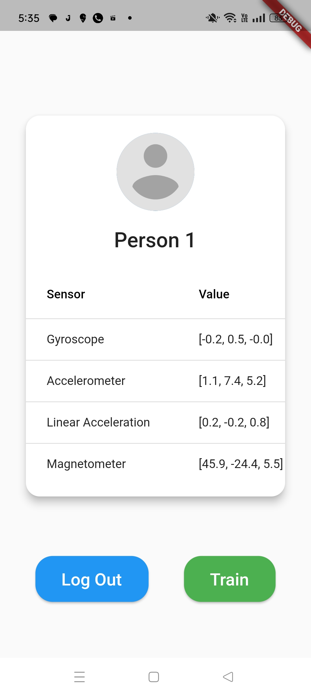

# Human Activity Recognition Using Smartphone sensors and cloud support

The use of Smartphones has ascended significantly over the last decade. With the new innovations, rise in technology and easier portability the production and sale of smartphones have also shown an increasing gradient over the years. One of the greatest add to smartphones are the various inbuilt sensors present in them. These sensors measure various scales of the person using the smartphone. Some of the sen- sors include accelerometer, gyroscope, magnetometer and so on. These sensor values are of great importance as they track the real-time values of the user. Human activity recognition has gained wide popularity and importance over a short period of time. Activity detection has given opportunities for a plethora of applications and usages. In our project, the main focus is to identify the various human activities using the inbuilt smartphone sensors of the user. The three fundamental axis values of each sensor are considered for detecting the activity. The project focuses on detecting the activities of 10 different individuals with the aid of the dataset available. The activity detection and the sensor values are displayed using a mobile application developed using Flutter. As the smartphone moves there will be variations in the sensor values and corresponding activity and the person is recognised and displayed simultaneously

## Aim Of The Project

The aim of this project is to develop a system that can identify and analyze the gait cycle patterns of individuals during specific activities using sensors in smart- phones and smartwatches. The system aims to detect anomalies in the gait pattern and report them to the administrator, utilizing cloud-based computational resources for heavy data processing. By leveraging gait biometrics, the system offers advan- tages in terms of security, continuous authentication, non-invasive authentication, and hands-free operation. The project also aims to address the potential latency and com- putational resource limitations of traditional smartphone-based systems by offloading processing tasks to the cloud, allowing for real-time analysis and efficient utilization of computing power.
This project is a starting point for a Flutter application.

## Proposed Model

The proposed system shown in (Fig.4.1) described talks about two main mod- ules and five sub modules.The main modules described are Cloud Module and An- droid Module. Cloud module consists of Workstation module and Activity recogniser. Where the mobile module consists of login module, admin module and client module. This module consists of two sub-modules Workstation and Activity Recogniser.The main role of the cloud module is to process the streamed data received from the mobile module and to send the processed data back to the mobile module.
Workstation module loads the machine learning model trained using KNN Algorithm into the Application Programming Interface (API) which is hosted in the cloud provider. Activity Recogniser module recognises the activity based on the streamed data processed using the workstation module. After the data is recognised it is then sent back to the mobile module as a JSON request.
Mobile Module is basically the frontend interface of the application created us- ing an open-source framework called Flutter. It consists of three submodules named Login, Admin and Client module.

Login Module is responsible for the user getting authenticated into the proposed system. For implement- ing this module usage of firebase, an application development platform provided by Google is used.According to the login credentials the page gets directed to the client and admin module respectively. Admin Module is responsible for monitoring all the client modules and handling the JSON output of the activity recogniser. This module uses different data structures like Hash Set in order to properly handle the streamed output response. It shows the various activities of 10 individuals simultaneously one after the other.Client Module is responsible for sending streamed sensor data to the cloud module.

## Result

 

